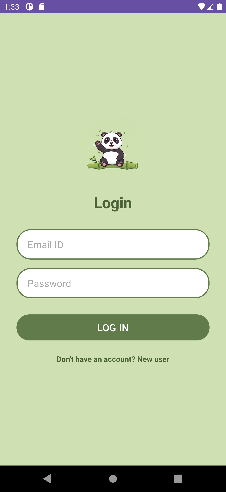
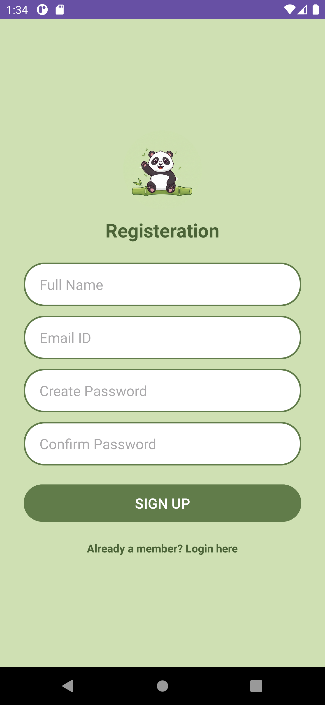
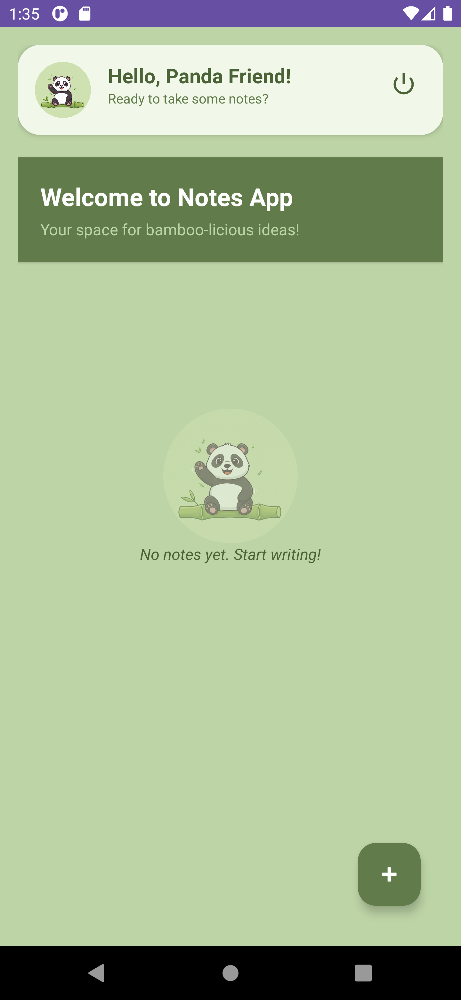
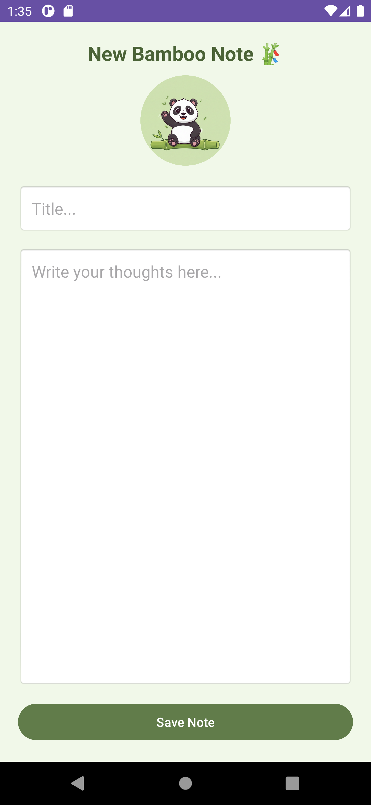
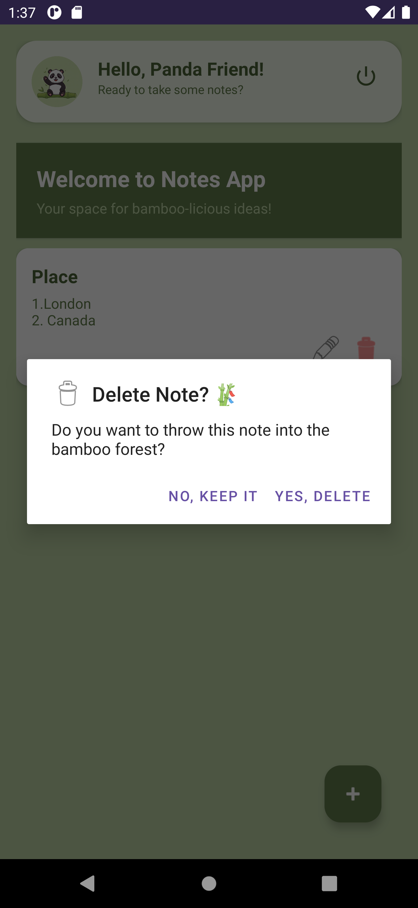

# 🐼 Panda Notes - Cloud Note-Taking App 🎋

Welcome to the official showcase of **Panda Notes**! 
This is a feature-rich, Android-based cloud application designed for a playful yet efficient note-taking experience.

> **🔐 Access Note:** The full source code (Java/XML) is hosted in a private repository for security purposes. 
> If you are a recruiter or developer and wish to review the code, please contact me to be added as a **Collaborator**.

---

## 📱 App Showreel
*Check out the cute Panda theme and Material UI transitions in the screenshots below:*

| Splash & Welcome | Login Page | Registration |
| :---: | :---: | :---: |
|  |  |  |

| Dashboard | New Bamboo Note | Delete Dialog |
| :---: | :---: | :---: |
|  |  |  |

---

## 🛠️ Key Technical Features
* **Cloud Integration:** Seamless real-time data synchronization using **Firebase Realtime Database**.
* **Full CRUD Logic:** Robust Create, Read, Update, and Delete operations for efficient note management.
* **Optimized Performance:** Smooth scrolling and high-speed list rendering implemented via **RecyclerView**.
* **Animated UI:** Interactive "Panda-Pop" animations and fluid transitions based on **Material Design** principles.

---

## 🤝 Connect & Collaborate
Feel free to reach out to me for collaborations or code review requests:

---
*Created with 💚 and Bamboo by Nupur Thakor.*
